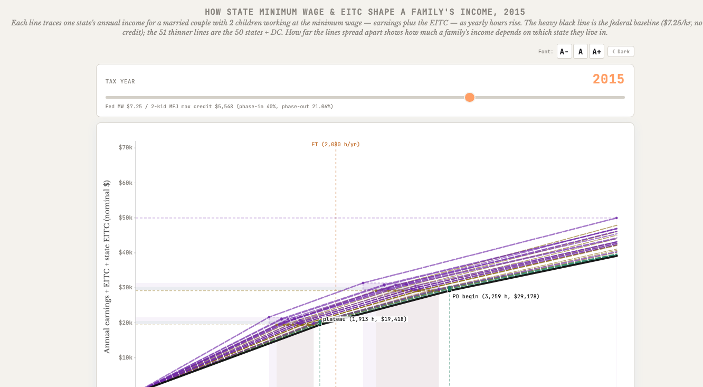

## Data Visualizations

::: {.resource}
### How State Minimum Wage & EITC Shape a Family's Income

Interactive visualization · 51-state budget constraints

<a class="resource-figure" href="resources/eitc-mw-budget-lines.html" target="_blank" aria-label="Open the interactive EITC and minimum wage visualization">

How far the lines spread shows how much a family's income depends on which state they live in. Click to open the interactive tool.
</a>

Description

How much does a low-wage family's income depend on where they live? This tool answers that visually. Each of 51 thin lines traces one state's annual budget constraint for a married couple with two children working at the minimum wage — earnings plus the federal EITC plus any state EITC top-up — as yearly hours rise. The heavy black line is the federal baseline ($7.25/hr, no state credit). The wider the lines fan apart, the more state policy alone determines a family's resources.

Shaded "variation envelope" bands mark the spread of policy kinks across states — where the EITC plateau begins, and where its phase-out starts and ends. Controls let you switch the tax year, toggle the state EITC top-up on or off, choose how non-refundable credits are treated, filter states by policy type (higher minimum wage, state EITC, both, or neither), and show or hide kink markers. Hover any state to label its kinks. Pre-tax, nominal dollars.

[Open visualization](resources/eitc-mw-budget-lines.html){target="_blank" aria-label="Open the interactive EITC and minimum wage visualization"}

:::
